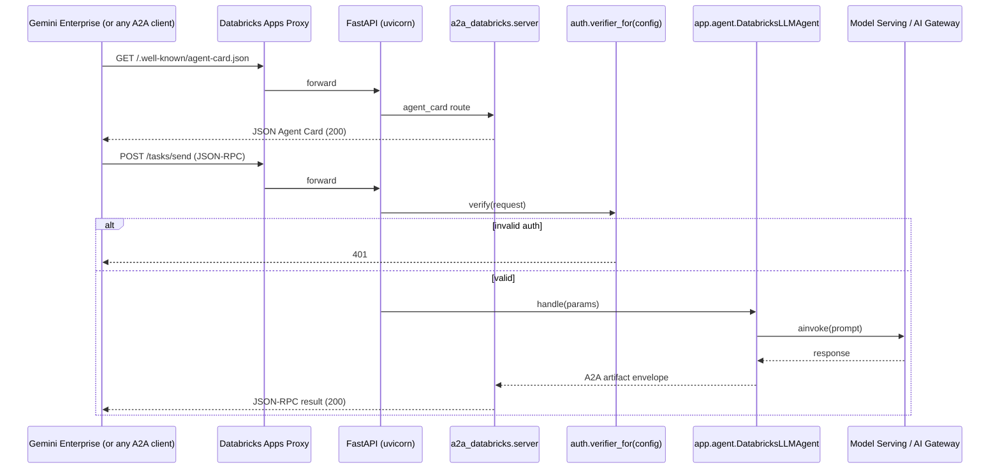

# ARCHITECTURE

## Request flow

## File-by-file purpose

| File | Owns | Edit when |
|---|---|---|
| `app.yaml` | Apps runtime command + env vars | Adding env vars; changing the run command |
| `requirements.txt` | Apps-installed deps (Apps does not read pyproject.toml) | Always; regen with `make export-reqs` |
| `pyproject.toml` | Local dev deps; source of truth | Adding/removing libraries |
| `src/app/main.py` | Wires config + auth + agent into FastAPI | Rarely — only for transport-layer changes |
| `src/app/agent.py` | **Your agent's behavior** | The vast majority of your edits live here |
| `src/a2a_databricks/card.py` | Agent Card Pydantic model | Updating A2A schema or adding metadata fields |
| `src/a2a_databricks/server.py` | FastAPI routes for `/tasks/*` | Adding new A2A endpoints (push notifications, etc.) |
| `src/a2a_databricks/auth.py` | Bearer + OAuth M2M + Anonymous verifiers | Adding a new auth scheme (mTLS, etc.) |
| `src/a2a_databricks/llm.py` | Databricks LLM factory (Model Serving + AI Gateway) | Adding fallbacks, OBO modes, judge wrappers |
| `src/a2a_databricks/config.py` | Pydantic settings from env | Adding env-driven config |
| `src/a2a_databricks/tracing.py` | MLflow tracing decorators | Custom span attributes |
| `notebooks/register_in_gemini.py` | One-shot Gemini Enterprise registration | When Google's API shape changes |
| `databricks.yml` | Bundle for IaC path | Multi-target deploys, extra resources |
| `resources/app.yml` | Bundle-declared App + experiment + UC grants | Changing resource topology |

## A2A protocol → kit code mapping

| A2A concept | Spec location | Kit code |
|---|---|---|
| **Agent Card** | `/.well-known/agent-card.json` | `a2a_databricks.card.AgentCard` + `server.py:agent_card` |
| **Skills** | Agent Card `.skills[]` | `card.AgentSkill`; declared in `app/agent.py:SKILLS` |
| **Security schemes** | Agent Card `.securitySchemes` | `card.SecurityScheme`; built from `config.auth_mode` |
| **tasks/send** | JSON-RPC 2.0 POST | `server.py:tasks_send` → `TaskHandler.handle` |
| **tasks/sendSubscribe** | SSE stream | `server.py:tasks_send_subscribe` → `TaskHandler.stream` |
| **Task envelope** | `{status, artifacts, history}` | `app.agent._envelope` |
| **Message parts** | `{kind, text, ...}` | `app.agent._extract_text` |

## Auth flows

### Bearer (default)
1. At deploy, the bearer token is stored in a Databricks secret (`A2A_BEARER_SECRET_*`).
2. `main.py:_resolve_bearer_token` reads it at app startup.
3. `BearerVerifier` does a constant-time compare on every inbound request.
4. The Agent Card advertises `securitySchemes.bearer = http+bearer` so clients know.

### OAuth M2M
1. The agent is configured with `A2A_OAUTH_AUDIENCE` + `A2A_OAUTH_ISSUER`.
2. `OAuthM2MVerifier` introspects the inbound token against the issuer's `/oauth2/introspect`.
3. Active + audience-matching tokens pass.
4. The Agent Card advertises `securitySchemes.oauth_m2m`.

### Anonymous (dev only)
1. `AnonymousVerifier` refuses to instantiate when `A2A_ENV=prod`.
2. In dev/staging it's a pass-through.
3. Useful for local curling without juggling secrets.

## Why FastAPI + Databricks Apps (not Model Serving)?

Model Serving endpoints are `/invocations`-only and don't support arbitrary HTTP routes,
`.well-known/*`, or SSE streaming. A2A requires all three. Databricks Apps exposes a
generic HTTP proxy in front of a long-running process, which is exactly what we need.
